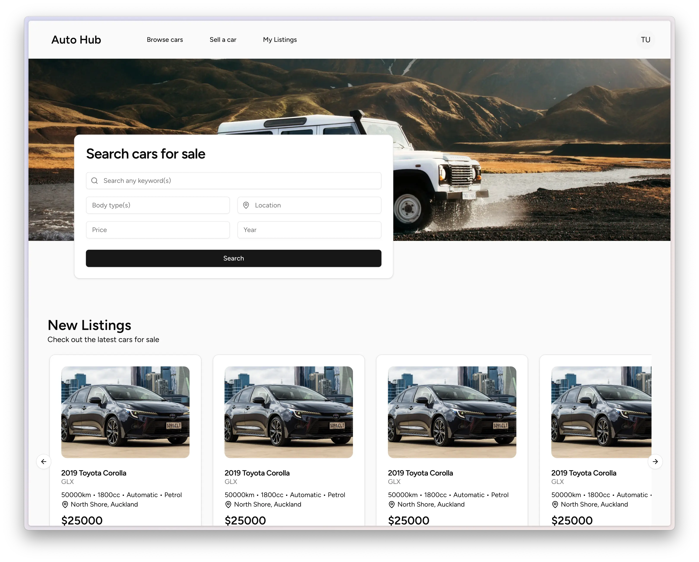

<h1 align="center">Auto Hub – Car Buy and Sell App</h1>
<div align="center">
  <i>Auto Hub car buy and sell web app project built with React and Laravel.</i>
</div>



### Contents
  - [Overview](#overview)
  - [Stack](#stack)
  - [Hosting](#hosting)
  - [Installation](#installation)
  - [Usage](#usage)
  - [License and Disclaimer](#license-and-disclaimer)

## Overview
This project is designed for me to learn Laravel 11 along with Inertia (using React), Artisan CLI, and Eloquent ORM.
Users are able to view currently listed cars and sign up to list their own car to the database.

## Stack
- **Frontend:** React using Inertia, TypeScript
- **Backend:** Laravel, PHP
- **Database:** SQLite, Eloquent ORM

Key tools:
- **Styling:** TailwindCSS, RadixUI, ShadcnUI

## Hosting
Not currently hosted.

## Installation
To run locally follow the steps below:

### Dependencies
Make sure the following have been installed:
- [PHP](https://www.php.net/downloads.php)
- [Composer](https://getcomposer.org/download/)
- [Laravel Installer](https://github.com/laravel/installer)
- [Node.js](https://nodejs.org/en/download/package-manager)

To install the PHP, Composer, and Laravel installer run the following command:
```
# macOS
/bin/bash -c "$(curl -fsSL https://php.new/install/mac/8.4)"

# Linux
/bin/bash -c "$(curl -fsSL https://php.new/install/linux/8.4)"

# PowerShell
# Run as administrator...
Set-ExecutionPolicy Bypass -Scope Process -Force; [System.Net.ServicePointManager]::SecurityProtocol = [System.Net.ServicePointManager]::SecurityProtocol -bor 3072; iex ((New-Object System.Net.WebClient).DownloadString('https://php.new/install/windows/8.4'))
```

Otherwise, if PHP and Composer are installed, you can install the Laravel installer via:
```
composer global require laravel/installer
```

Install Node.js via the commands:
```
# macOS & Linux nvm
curl -o- https://raw.githubusercontent.com/nvm-sh/nvm/v0.40.1/install.sh | bash
nvm install 22

# or brew
brew install node@22

# Windows
winget install Schniz.fnm
fnm env --use-on-cd | Out-String | Invoke-Expression
fnm use --install-if-missing 22
```

### Steps to Run
1. Clone the `auto-hub` repo:


```
git clone https://github.com/jackdar/auto-hub
```

2. Move into the `auto-hub` directory:

```
cd auto-hub
```

3. Copy the `.env.example` file and generate project key:

```
cp .env.example .env
php artisan key:generate
```

4. Install npm packages and build static assets:

```
npm install && npm run build
```

5. Run database migrations and seed database:

```
php artisan migrate --seed
```

6. Run the composer script:


```
composer run dev
```

7. That's it, the project should be running on port `8000`.
